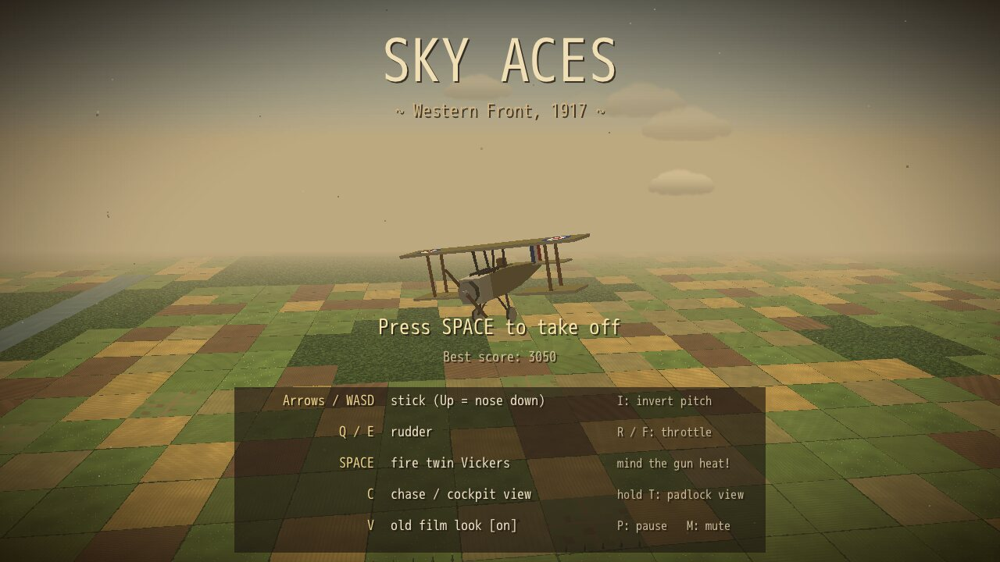
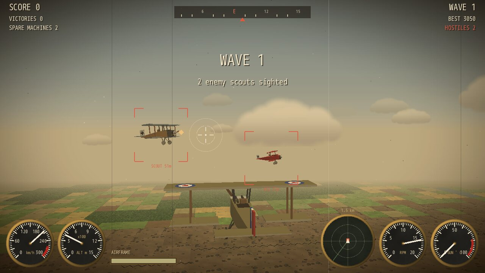
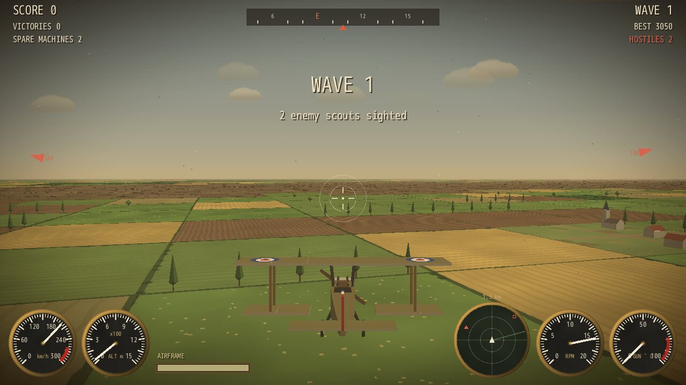
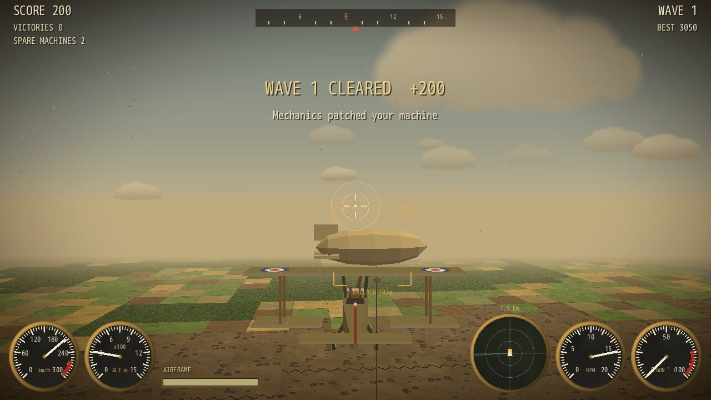
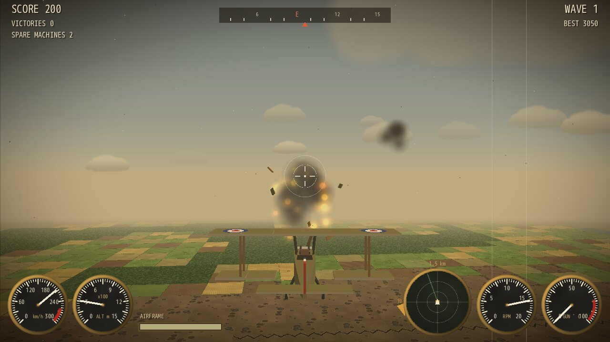
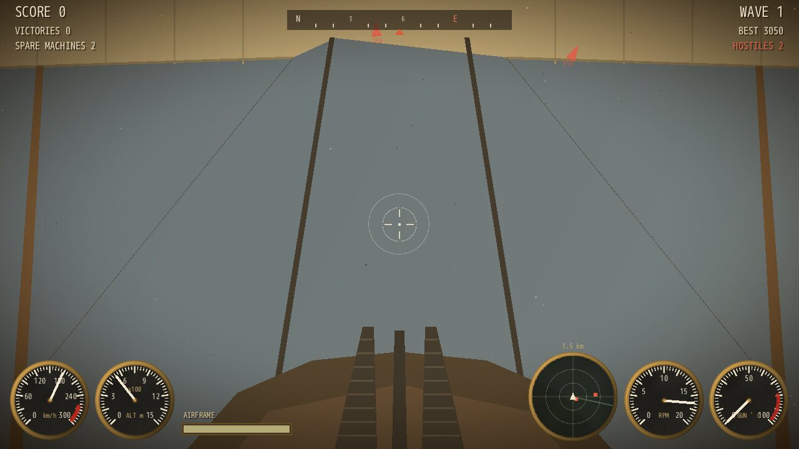

# Sky Aces 1917

**A vintage Great War dogfighting game, software-rendered in pure Ruby.**

Take the controls of a canvas-and-wire biplane over the Western Front. Shoot down
waves of enemy scouts and red triplane aces, set observation balloons ablaze
behind the lines, and dodge the flak, all through the flicker of an old newsreel.

Built with [DragonRuby Game Toolkit](https://dragonruby.org/) on the
[d3d](https://github.com/webmatze/d3d) 3D engine: no GPU shaders, no model files,
no image or audio files made by hand. Every triangle, texture and sound comes
from Ruby code.



| | |
|---|---|
|  |  |
|  |  |

## Features

- **Six-degree-of-freedom flight**: loop, roll and dive without gimbal lock.
  Banking turns the plane, diving trades height for speed, and slow planes stall.
- **Enemy pilots** that chase your lead point, fire short bursts, jink when you
  sit on their tail and break off to extend. Red triplane aces show up from wave 3.
- **Twin Vickers guns** that overheat and jam if you hold the trigger too long.
- **Observation balloons** to flame behind the enemy lines, and anti-aircraft
  fire ("Archie") bursting around you whenever you cross them.
- **An endless, generated Western Front**: patchwork fields, forests, villages
  with churches, poplar-lined roads, a winding river, and a zig-zag trench line
  through cratered no-man's-land.
- **Brass instruments**: airspeed, altimeter, RPM, gun temperature, compass tape
  and a heading-up radar scope.
- **Chase, cockpit and padlock views**. The cockpit view has the twin guns,
  cabane struts and the upper wing overhead.
- **Old-film look**: sepia grading, film grain, scratches, dust and a vignette
  (toggle with `V`).
- **Procedural sound**: rotary engine drone, wind, machine guns, hits and explosions.



## Getting started

You need [DragonRuby GTK](https://dragonruby.org/). The project pins DragonRuby
Pro 7.21 in `Smaug.toml`, and any recent DragonRuby should run it.

```bash
git clone https://github.com/webmatze/sky_aces_1917.git
cd sky_aces_1917
smaug run            # with Smaug
# or
dragonruby .         # with the DragonRuby binary on your PATH
```

### Performance and D3D Pro (optional)

The game runs entirely in pure Ruby on the free d3d engine. If you own
[D3D Pro](https://webmatze.itch.io/d3d-pro), copy its `native/` folder into the
game directory: the game detects the C extension and uses it for the ground
renderer and depth sorting, with a longer view distance and finer ground detail.
Ruby time per frame measured headless in the worst case (flying low over
detailed ground):

| Render path | Ruby time per frame |
|---|---|
| Pure Ruby (free d3d) | ~10 ms |
| With the D3D Pro C extension | ~6 ms |

The extension isn't part of this repository, and `native/` is git-ignored.

## Controls

| Key | Action |
|---|---|
| `↑` `↓` `←` `→` / `W` `A` `S` `D` | Stick: Up = nose down, Down = pull up, Left/Right = roll |
| `Q` / `E` | Rudder |
| `R` / `F` (or `Shift` / `Ctrl`) | Throttle up / down |
| `Space` (or `J`) | Fire |
| `C` | Chase / cockpit view |
| hold `T` (or `Tab`) | Padlock view on the nearest enemy |
| `I` | Invert pitch |
| `V` | Old-film look on / off |
| `P` / `M` / `Esc` | Pause / mute / back to the title |

**Gamepad:** left stick flies, right stick is rudder, `A` or `RT` fires, `LB`/`RB`
set the throttle, `Start` takes off.

## How to play

- Each wave brings more enemy scouts. From wave 3, some are red triplane aces:
  tougher and sharper shots.
- Even-numbered waves add tethered observation balloons behind the enemy lines,
  worth 300 points.
- Clearing a wave earns a bonus and a quick patch-up from your mechanics.
- You have three machines. When the last one goes down, it's game over.
  Your best score is saved.
- The enemy lines lie **east**; the compass marks east in red. Over them, expect Archie.
- The diamond near an enemy is its lead point: aim there, not at the plane.
- The radar is heading-up and covers 1.5 km. A triangle means the contact is
  more than 80 m above (pointing up) or below you. Hollow squares on the rim are
  out of range.
- Watch the gun temperature gauge. Short bursts keep the guns firing.

## How it works

The game uses the 6DOF part of d3d: `D3D::Pose` for the planes and the camera,
`D3D::SceneRenderer` for textured quads, glow billboards and back-to-front
sorting, and `D3D::FlatMesh` for the models. A few tricks on top:

- **Big ground tiles without texture swimming.** d3d's `draw_face` subdivides
  quads by distance, tuned for 10 m mine cells. The ground pass renders a copy of
  the world scaled down 8–14×. Projection doesn't change, but the subdivision now
  kicks in 8–14× farther away, which hides affine texture warping on the 100 m tiles.
- **Banding-free sky and haze.** A view ray's elevation is linear in screen space,
  and DragonRuby maps textures affinely across triangles. So a single gradient
  texture on the horizon polygon reproduces a smooth sky exactly. The same trick
  fades the ground into haze where the drawn terrain ends.
- **Sun-lit models with painted markings.** `GameRenderer#draw_model` lights
  meshes by the sun and fades them into the horizon haze. Roundels and crosses
  are "decal" triangles that sort just in front of the surface they sit on.
- **Everything procedural.** `tools/gen_assets.rb` writes all PNG textures and WAV
  sounds with nothing but Ruby and zlib. `app/game/models.rb` builds every plane,
  balloon, house and tree from boxes, cylinders and discs.

## Project layout

```
app/main.rb            entry point
app/d3d/               the free d3d engine (v1.0.0), vendored unchanged
app/game/
  game.rb              game flow, waves, combat, camera, audio, render passes
  plane.rb             flight model, guns and damage (player and enemies)
  ai.rb                enemy pilots
  world.rb             procedural ground, trench line, river, villages, clouds
  models.rb            low-poly biplane, triplane, balloon, houses, trees
  gfx.rb               GameRenderer < D3D::SceneRenderer: sun-lit meshes, billboards, sky, haze
  effects.rb           particles, debris, balloons
  hud.rb               gauges, gunsight, markers, compass, radar, cockpit, film filter
sprites/, sounds/      generated assets (see tools/gen_assets.rb)
tools/                 asset generator and headless test runs
```

## Development

```bash
ruby tools/gen_assets.rb                          # regenerate every texture and sound
ruby tools/smoke.rb                               # headless autopilot dogfight: timings + screenshots
ruby tools/smoke.rb --eval tools/smoke_death.rb   # get shot down: respawn and game over
ruby tools/smoke.rb --eval tools/smoke_scenes.rb  # staged scenes for visual checks
```

The smoke runs start DragonRuby headless (SDL dummy video driver), report
exceptions and Ruby time per tick, and save screenshots to `$TMPDIR`.

Difficulty is mostly set by enemy agility (`spawn_enemy` in
`app/game/game.rb`) and by the AI's pull limit and break-off patience
(`app/game/ai.rb`).

## Credits

- Game and engine by [webmatze](https://github.com/webmatze). The d3d engine is
  MIT licensed (see its repository).
- Built with [DragonRuby Game Toolkit](https://dragonruby.org/). Its license
  terms are in `open-source-licenses.txt`.
